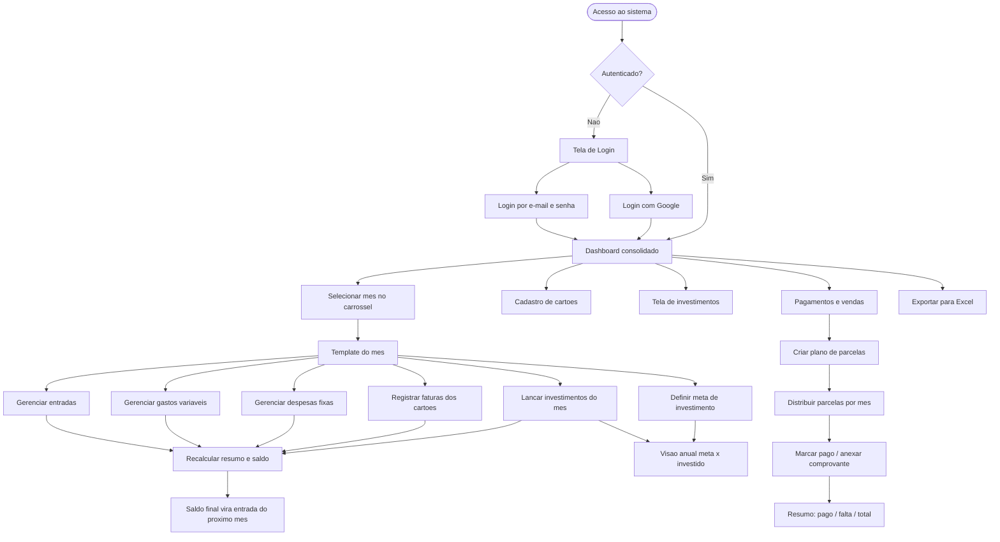
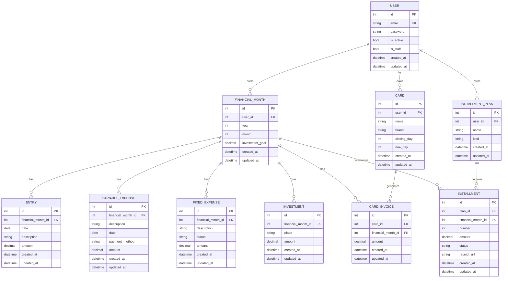

> **Product Requirement Document** Gerenciador de finanças pessoais em **Python + Django (full stack)**, organizado por mês, com template replicável, controle de cartões, investimentos com meta e gestão de pagamentos/vendas parcelados.
> 
> Parte do ecossistema **Enob** · Identidade visual baseada no Design System Enobtech. Versão do documento: 1.0

---

## 1. Visão Geral

O **EnobFinance** é um sistema web de finanças pessoais que centraliza, em um só lugar, tudo o que entra e sai do orçamento — entradas, saídas, despesas fixas, faturas de cartão, investimentos e compras/vendas parceladas — com uma visão **mês a mês** e um **dashboard consolidado** (mensal e anual).

A ideia central é que cada mês funciona como uma "página" própria, gerada a partir de um **template base** idêntico. Esse template se repete para todos os meses (Janeiro/2026 em diante, sem data final), e o usuário navega entre eles como num **carrossel**. O que muda de um mês para o outro são apenas os dados; a estrutura permanece a mesma.

O sistema é construído inteiramente em **Django full stack**: backend, regras de negócio e frontend renderizado via **Django Template Language (DTL)** estilizado com **TailwindCSS**. Banco **SQLite**, autenticação nativa do Django com **login por e-mail** e opção de login com Google.

---

## 2. Sobre o Produto

EnobFinance é uma aplicação web monolítica, de uso pessoal, focada em organização financeira mensal. Diferente de planilhas soltas, ele estrutura o orçamento em um modelo replicável e conectado: o saldo de um mês conversa com o próximo, a meta de investimento dialoga com o que foi efetivamente aplicado, e parcelamentos se distribuem automaticamente ao longo dos meses.

### Diferenciais

- **Template mensal replicável** — um único modelo aplicado a qualquer mês.
- **Continuidade entre meses** — o saldo final de um mês vira entrada do mês seguinte.
- **Meta de investimento por mês** — definida manualmente, com o valor investido puxado automaticamente dos lançamentos do próprio mês.
- **Gestão de parcelamentos** — pagamentos e vendas divididos em parcelas, com status e link de comprovante.
- **Exportação completa para Excel** — todos os dados exportáveis em uma planilha `.xlsx`.

---

## 3. Propósito

Dar ao usuário **clareza e controle** sobre a própria vida financeira, substituindo planilhas manuais e desconectadas por um sistema que:

- Mostra a saúde financeira de cada mês em segundos.
- Mantém histórico contínuo sem retrabalho de montar planilha nova a cada mês.
- Conecta metas de investimento ao que foi realmente investido.
- Acompanha parcelamentos de longo prazo (compras e vendas) sem perder o controle do que falta pagar/receber.
- Permite exportar tudo para Excel quando necessário.

---

## 4. Público-alvo

- **Usuário primário:** pessoa física que controla as próprias finanças de forma detalhada e organizada por mês.
- **Perfil:** alguém que já usa planilhas para finanças, gosta de granularidade (entradas, saídas, despesas fixas, faturas, investimentos, parcelas) e quer migrar para uma ferramenta estruturada, sem complexidade de apps comerciais.
- **Escopo inicial:** uso pessoal / single user por conta, com suporte nativo a múltiplos usuários isolados (cada usuário enxerga apenas seus dados).

---

## 5. Objetivos

1. Entregar um sistema **simples, enxuto e responsivo**, sem over-engineering.
2. Padronizar a experiência: **todas as telas com o mesmo design system e componentes**.
3. Estruturar o domínio em **apps Django isolados por responsabilidade**.
4. Permitir o **registro completo do mês** (entradas, saídas, despesas fixas, faturas, investimentos) em um template replicável.
5. Implementar **navegação fluida entre meses** (carrossel).
6. Conectar **meta de investimento ↔ investido real** automaticamente.
7. Gerenciar **pagamentos e vendas parcelados** com status e comprovante.
8. Disponibilizar **exportação total para Excel**.
9. Autenticar via **e-mail** (e opcionalmente Google).

---

## 6. Requisitos Funcionais

|ID|Requisito|Descrição|
|---|---|---|
|RF01|Autenticação por e-mail|Cadastro e login usando e-mail e senha (não username)|
|RF02|Login com Google|Login via interface usando conta Google (opcional, sprint posterior)|
|RF03|Dashboard consolidado|Resumo financeiro mensal e anual na tela inicial|
|RF04|Mês financeiro|Criar e visualizar um mês com o template base completo|
|RF05|Navegação entre meses|Carrossel/sidebar para avançar e retroceder entre meses|
|RF06|Entradas|CRUD de receitas do mês (data, descrição, valor)|
|RF07|Gastos variáveis (saídas)|CRUD de despesas variáveis (descrição, data, forma de pagamento, valor)|
|RF08|Despesas fixas|CRUD de despesas fixas com status pago/não pago|
|RF09|Resumo do mês|Cálculo automático de totais (entradas, saídas, investido, cartão)|
|RF10|Saldo atual|Saldo final do mês, com carry-over para o mês seguinte|
|RF11|Cadastro de cartões|CRUD de cartões (nome, bandeira, fechamento, vencimento)|
|RF12|Faturas dos cartões|Registrar valor da fatura de cada cartão por mês|
|RF13|Investimentos|CRUD de investimentos do mês (local, valor)|
|RF14|Meta de investimento|Definir meta mensal; investido puxado automaticamente|
|RF15|Tela de investimentos|Visão anual meta × realizado|
|RF16|Pagamentos parcelados|Criar pagamento com N parcelas, status e comprovante|
|RF17|Vendas parceladas|Mesma estrutura de pagamento, fluxo de entrada|
|RF18|Resumo de parcelamento|Pago / falta pagar / total por plano|
|RF19|Exportação Excel|Exportar todos os dados em `.xlsx` com múltiplas abas|
|RF20|Isolamento por usuário|Cada usuário enxerga apenas seus próprios dados|

### 6.1 Fluxograma de UX (Mermaid)



---

## 7. Requisitos Não-Funcionais

|ID|Requisito|Descrição|
|---|---|---|
|RNF01|Simplicidade|Sem over-engineering; código simples e enxuto, apenas o solicitado|
|RNF02|Stack única|Django full stack, frontend em DTL + TailwindCSS|
|RNF03|Responsividade|Layout responsivo (mobile, tablet, desktop)|
|RNF04|Consistência visual|Mesmo design system e componentes em todas as telas|
|RNF05|Banco de dados|SQLite padrão do Django|
|RNF06|Idioma do código|Todo o código em inglês|
|RNF07|Idioma da UI|Toda a interface em português brasileiro|
|RNF08|Estilo de código|Aspas simples sempre que possível|
|RNF09|Padrão Django|Class Based Views, classes, funções e recursos nativos|
|RNF10|Auditoria|Todo model com `created_at` e `updated_at`|
|RNF11|Organização|Domínios isolados em apps com prefixo `app_`|
|RNF12|Templates|Todos os templates na pasta raiz `templates/`|
|RNF13|Signals|Se usados, ficam em `signals.py` dentro da app correspondente|
|RNF14|Segurança|Isolamento de dados por usuário; proteção CSRF nativa|
|RNF15|Evolução|Docker e testes deixados para sprints finais|

---

## 8. Arquitetura Técnica

### 8.1 Stack

|Camada|Tecnologia|Observação|
|---|---|---|
|Backend|**Python 3.12+ / Django 5.x**|Core, ORM e regras de negócio|
|Banco de dados|**SQLite** (padrão do Django)|Único banco do projeto|
|Frontend|**Django Template Language + TailwindCSS**|Sem framework JS adicional|
|Estilização|**TailwindCSS** (via CDN ou build)|Design system todo em utilitários Tailwind|
|Autenticação|**Django Auth nativo**|Custom User com login por e-mail|
|Login social|**Google OAuth** (sprint posterior)|Única dependência externa justificada|
|Exportação|**openpyxl**|Geração de `.xlsx` multi-abas|

> **Sobre dependências externas:** o projeto prioriza recursos nativos do Django. As únicas bibliotecas externas previstas são `openpyxl` (exportação Excel, já no escopo do produto) e a lib de OAuth do Google (login social, opcional, sprint posterior).

### 8.2 Organização em Apps (domínios isolados)

|App|Responsabilidade|
|---|---|
|`app_core`|Base abstrata (`TimestampedModel`), template base, mixins compartilhados, home/redirect|
|`app_accounts`|Custom User (login por e-mail), autenticação, login com Google|
|`app_months`|Mês financeiro e seus lançamentos: entradas, gastos variáveis, despesas fixas, resumo e saldo|
|`app_cards`|Cartões de crédito e faturas mensais|
|`app_investments`|Investimentos do mês e visão anual meta × realizado|
|`app_installments`|Planos de parcelamento (pagamentos e vendas) e suas parcelas|
|`app_dashboard`|Dashboard consolidado (mensal e anual)|
|`app_exports`|Exportação de todos os dados para Excel|

### 8.3 Estrutura de Dados (Mermaid)

Todos os models herdam de `TimestampedModel` (campos `created_at` e `updated_at`). Valores como totais e saldos são **calculados** (não armazenados).



### 8.4 Regras de Negócio

1. **Continuidade de saldo** — o saldo final de um mês entra como "saldo do mês anterior" (entrada) no mês seguinte.
2. **Meta × investido** — a meta mensal é manual; o investido é sempre derivado da soma dos investimentos do mês, nunca digitado na tela de investimentos.
3. **Template replicável** — todo mês novo nasce da mesma estrutura base.
4. **Parcelamento** — planos geram N parcelas distribuídas pelos meses, cada uma com status e comprovante próprios.
5. **Pagamento × venda** — mesma estrutura; diferença apenas no `kind` (saída vs. entrada).
6. **Comprovantes por link** — guarda-se a URL do comprovante (Google Drive), não o arquivo.
7. **Isolamento por usuário** — todas as queries filtram pelo usuário autenticado.

---

## 9. Design System

Identidade visual premium e moderna, com **gradientes harmônicos** e estética sofisticada (dark premium), construída inteiramente com **TailwindCSS dentro do Django Template Language**. Base nos tokens do Design System Enobtech.

> **Estrutura de templates:** todos os arquivos de template ficam na pasta raiz `templates/`, organizados por app (ex.: `templates/app_months/month_detail.html`). O template base `templates/base.html` define o layout, a navegação e os blocos reaproveitados em todas as telas.

### 9.1 Cores

#### Cores primárias e de marca

|Token|Hex|Uso|
|---|---|---|
|`brand-blue`|`#0066FF`|Cor primária — botões, links, destaques, ícones|
|`brand-blue-light`|`#00AAFF`|Final do gradiente primário|
|`brand-dark`|`#000918`|Fundo dark premium, cabeçalhos, sidebar|
|`brand-surface`|`#0A1428`|Superfícies elevadas no dark (cards)|
|`brand-gray-dark`|`#454D60`|Texto secundário|

#### Cores de apoio e estado

|Token|Hex|Uso|
|---|---|---|
|`gray-50`|`#F9FAFB`|Fundo claro alternado|
|`gray-100`|`#F3F4F6`|Bordas de cards|
|`gray-200`|`#E5E7EB`|Bordas de inputs, divisores|
|`gray-500`|`#6B7280`|Texto terciário/placeholder|
|`green-400`|`#22C55E`|Estado positivo (pago, saldo positivo)|
|`red-400`|`#EF4444`|Estado negativo (não pago, saldo negativo)|
|`yellow-400`|`#FBBF24`|Alertas e destaques|

#### Cores de fundo

|Contexto|Light|Dark|
|---|---|---|
|Body|`#FFFFFF`|`#000918`|
|Seções alternadas|`#F9FAFB`|`#0A1428`|
|Cards|`#FFFFFF`|`#0A1428`|
|Cabeçalhos de tabela|`#000918` (texto branco)|`#000918`|

#### Gradientes (assinatura visual)

|Nome|Definição Tailwind|Uso|
|---|---|---|
|Gradiente primário|`bg-gradient-to-r from-[#0066FF] to-[#00AAFF]`|Botões principais, destaques|
|Gradiente de título|`bg-gradient-to-r from-[#0066FF] to-[#00AAFF] bg-clip-text text-transparent`|Palavras em destaque|
|Hero/glow|`bg-[radial-gradient(80%_60%_at_50%_-5%,rgba(0,102,255,0.18),transparent)]`|Brilho de fundo no topo|
|Card premium|`bg-gradient-to-br from-[#0A1428] to-[#000918]`|Cards de saldo e resumo|

### 9.2 Tipografia

|Propriedade|Valor|
|---|---|
|Família|**Sora**, sans-serif (`font-['Sora']`)|
|Pesos|400, 500, 600, 700|
|Base|15px|
|Títulos de tela|`text-3xl font-bold`|
|Títulos de card|`text-lg font-semibold`|
|Corpo|`text-base font-normal`|
|Labels|`text-sm font-medium`|

### 9.3 Botões

```html
<!-- Primário (gradiente) -->
<button class='inline-flex items-center gap-2 px-6 py-3 rounded-xl
               bg-gradient-to-r from-[#0066FF] to-[#00AAFF] text-white
               text-sm font-semibold shadow-lg shadow-blue-500/25
               hover:shadow-blue-500/40 transition-all'>
  Salvar
</button>

<!-- Secundário (ghost) -->
<button class='inline-flex items-center gap-2 px-6 py-3 rounded-xl
               border border-gray-200 text-gray-700 text-sm font-medium
               hover:bg-gray-50 transition-all'>
  Cancelar
</button>

<!-- Destrutivo -->
<button class='px-4 py-2 rounded-lg bg-red-50 text-red-600 text-sm
               font-medium hover:bg-red-100 transition-all'>
  Excluir
</button>
```

### 9.4 Inputs e Forms

```html
<div class='flex flex-col gap-1.5'>
  <label class='text-sm font-medium text-[#000918]'>Descrição</label>
  <input type='text'
         class='w-full px-4 py-3 rounded-lg bg-gray-50 border border-gray-200
                text-[#454D60] text-base placeholder-gray-400
                focus:border-[#0066FF] focus:ring-2 focus:ring-blue-100
                outline-none transition-all'
         placeholder='Ex.: Salário'>
</div>

<!-- Select -->
<select class='w-full px-4 py-3 rounded-lg bg-gray-50 border border-gray-200
               text-[#454D60] focus:border-[#0066FF] outline-none transition-all'>
  <option>PIX</option>
  <option>Débito</option>
</select>
```

Forms seguem layout vertical com `gap-4`, label acima do input, mensagens de erro em `text-sm text-red-500` abaixo do campo.

### 9.5 Grids

|Contexto|Classe Tailwind|
|---|---|
|Cards de resumo|`grid grid-cols-1 sm:grid-cols-2 lg:grid-cols-4 gap-4`|
|Conteúdo do mês|`grid grid-cols-1 lg:grid-cols-2 gap-6`|
|Container máximo|`max-w-screen-2xl mx-auto px-6 md:px-10 xl:px-16`|
|Tabelas|`w-full overflow-x-auto` com `min-w-full` interno|

### 9.6 Cards

```html
<div class='rounded-2xl bg-white border border-gray-100 shadow-sm p-6'>
  <h3 class='text-lg font-semibold text-[#000918] mb-4'>Resumo do mês</h3>
  <!-- conteúdo -->
</div>

<!-- Card de destaque (saldo) -->
<div class='rounded-2xl bg-gradient-to-br from-[#0A1428] to-[#000918]
            text-white p-6 shadow-xl'>
  <p class='text-sm text-white/60'>Saldo atual</p>
  <p class='text-3xl font-bold'>R$ 192,35</p>
</div>
```

### 9.7 Menus / Navegação

- **Sidebar** (desktop): `bg-[#000918] text-white/70`, largura fixa, links com `hover:bg-white/5 rounded-lg`, item ativo com gradiente azul.
- **Topbar**: `h-[68px] bg-white/90 backdrop-blur border-b border-gray-200` (light) / `bg-[#000918]/90` (dark).
- **Carrossel de meses**: barra horizontal com pílulas `rounded-full`, mês ativo em gradiente azul, navegação por setas anterior/próximo.
- **Toggle de tema** claro/escuro via estratégia Tailwind `class`.

### 9.8 Estados (Status pills)

```html
<!-- Pago -->
<span class='px-3 py-1 rounded-full bg-green-50 text-green-600 text-xs font-semibold'>Pago</span>
<!-- Não pago -->
<span class='px-3 py-1 rounded-full bg-red-50 text-red-600 text-xs font-semibold'>Não pago</span>
```

---

## 10. User Stories

### Épico 1 — Autenticação

- **US1.1** — Como usuário, quero me cadastrar com e-mail e senha para ter uma conta.
    - **Critérios de aceite:** o cadastro usa e-mail (não username); senha validada pelo Django; e-mail único; ao cadastrar, sou redirecionado ao dashboard.
- **US1.2** — Como usuário, quero fazer login com meu e-mail e senha.
    - **Critérios de aceite:** login por e-mail funciona; credenciais inválidas mostram erro em pt-BR; sessão mantida; logout disponível.
- **US1.3** — Como usuário, quero entrar com minha conta Google.
    - **Critérios de aceite:** botão "Entrar com Google" na tela de login; fluxo OAuth conclui criando/associando a conta; redireciona ao dashboard.

### Épico 2 — Mês financeiro

- **US2.1** — Como usuário, quero abrir um mês e ver o template completo.
    - **Critérios de aceite:** o mês exibe resumo, saldo, entradas, saídas, despesas fixas, faturas e investimentos; dados isolados por usuário.
- **US2.2** — Como usuário, quero navegar entre meses como num carrossel.
    - **Critérios de aceite:** setas avançam/retrocedem; meses a partir de Janeiro/2026; mês ativo destacado.
- **US2.3** — Como usuário, quero lançar entradas, saídas e despesas fixas.
    - **Critérios de aceite:** CRUD completo de cada tipo; ao salvar, o resumo e o saldo recalculam automaticamente.
- **US2.4** — Como usuário, quero que o saldo final vire entrada do próximo mês.
    - **Critérios de aceite:** o "saldo do mês anterior" aparece automaticamente no resumo do mês seguinte.

### Épico 3 — Cartões

- **US3.1** — Como usuário, quero cadastrar meus cartões.
    - **Critérios de aceite:** CRUD com nome, bandeira, dia de fechamento e vencimento.
- **US3.2** — Como usuário, quero registrar a fatura de cada cartão no mês.
    - **Critérios de aceite:** valor da fatura por cartão e mês; total de cartões somado no resumo do mês.

### Épico 4 — Investimentos

- **US4.1** — Como usuário, quero lançar investimentos do mês.
    - **Critérios de aceite:** CRUD com local e valor; soma reflete no resumo do mês.
- **US4.2** — Como usuário, quero definir uma meta mensal e comparar com o realizado.
    - **Critérios de aceite:** meta editável por mês; tela anual mostra meta × investido com investido puxado automaticamente dos lançamentos.

### Épico 5 — Pagamentos e Vendas

- **US5.1** — Como usuário, quero criar um plano parcelado de pagamento ou venda.
    - **Critérios de aceite:** defino nome, quantidade de parcelas, valor e mês de cada; distribui as parcelas.
- **US5.2** — Como usuário, quero marcar parcelas como pagas e anexar comprovante.
    - **Critérios de aceite:** status por parcela; campo de link de comprovante; resumo pago/falta/total atualiza.

### Épico 6 — Dashboard e Exportação

- **US6.1** — Como usuário, quero um dashboard com resumo mensal e anual.
    - **Critérios de aceite:** cards consolidados; dados do usuário autenticado.
- **US6.2** — Como usuário, quero exportar todos os meus dados para Excel.
    - **Critérios de aceite:** botão de exportar; gera `.xlsx` com abas (resumo anual, meses, cartões, pagamentos, vendas); download imediato.

---

## 11. Métricas de Sucesso

### KPIs de Produto

|KPI|Meta|
|---|---|
|Telas com design system consistente|100%|
|Cobertura de funcionalidades core do PRD|100%|
|Tempo de carregamento de tela|< 1s (SQLite local)|
|Erros não tratados em produção|0|

### KPIs de Usuário

|KPI|Meta|
|---|---|
|Meses preenchidos por usuário ativo|≥ 3|
|Uso recorrente (retorno mensal)|Usuário registra dados todo mês|
|Exportações Excel realizadas|≥ 1 por usuário ativo|
|Planos de parcelamento acompanhados|≥ 1 ativo por usuário|

### KPIs Técnicos

|KPI|Meta|
|---|---|
|Apps isolados por domínio|100% das entidades|
|Models com `created_at`/`updated_at`|100%|
|Templates centralizados em `templates/`|100%|
|Padrão de código (aspas simples, inglês, CBV)|Aderência total|

---

## 12. Riscos e Mitigações

|Risco|Impacto|Mitigação|
|---|---|---|
|Cálculos derivados (saldo, totais) inconsistentes|Alto|Calcular sempre em tempo real via métodos/propriedades; não armazenar valores agregados|
|Escopo crescer além do planejado (over-engineering)|Médio|Seguir estritamente o PRD; recusar features não solicitadas|
|Complexidade do login Google atrasar o core|Médio|Login por e-mail no início; Google em sprint posterior|
|Carry-over de saldo entre meses gerar loop/erro|Médio|Buscar o mês anterior por (ano, mês) e tratar ausência com valor zero|
|Distribuição de parcelas por mês confusa|Médio|Cada parcela referencia explicitamente um mês financeiro|
|Performance da exportação Excel com muitos dados|Baixo|Gerar workbook em memória com openpyxl; uso pessoal mantém volume baixo|
|SQLite em concorrência multiusuário|Baixo|Uso pessoal; manter operações simples e curtas|
|Divergência visual entre telas|Médio|Componentes reaproveitados via `templates/` e base única|

---

_Documento de Requisitos do Produto — EnobFinance · Ecossistema Enob._